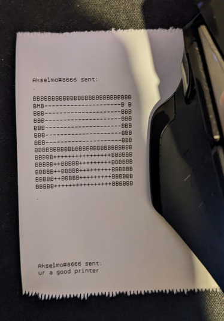

# Discord bot that prints from your devterm!

Simple discord bot that prints any message you give it to my devterm printer.

Can also be used for other printer devices.. If you dare.

Example of the printer output:



# Setup

## 1. Download discord.py

[Discord.py github](https://github.com/Rapptz/discord.py)

```
python3 -m pip install -U discord.py
```

## 2. Give bot the token
Create `token.txt` file with your bots token in same folder as `printerbot.py` is.
Token has to be on the first line.

## 3. Run the bot!

```
python3 printerbot.py
```

## 4. Send bot a message!

```
$print Hello world!
```

It should report you what's happening and if all goes well, print the message.

# Notes

Devterm printer seems to support only ASCII characters.

